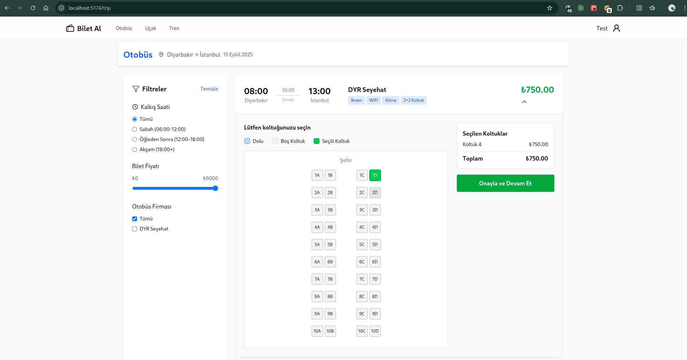

# 🎫 Biletal

Django REST Framework + React (Redux) + Redis + Websocket kullanılarak geliştirilmiş, çok kullanıcı tipi destekleyen bilet rezervasyon sistemi.

## 🚀 Özellikler

- 🚌 Ulaşım Tipleri: Otobüs, Uçak, Tren
- 📍 Rota bazlı sefer sorgulama
- 🕒 Filtreleme: Kalkış saati, firma, fiyat aralığı
- 💺 Koltuk seçimi (tekil seçim)
- 🧾 API üzerinden rezervasyon
- 🎛️ Yönetim Paneli (Django Admin)
- 🌐 Postgres veritabanı desteği


---




## 🛠️ Kurulum

### Backend (Django)

Aşagıdaki bilgilere göre veritabanı oluşturun.
```json
DATABASES = {
    "default": {
        "ENGINE": "django.db.backends.postgresql",
        'NAME': 'biletdb',
        'USER': 'postgres',
        'PASSWORD': 'root123',
        'HOST': 'localhost',
        'PORT': '5432',
    }
}


```bash
# Ortam oluştur
python -m venv venv
source venv/bin/activate

# Gereksinimleri yükle
pip install -r requirements.txt

# Veritabanını oluştur
python manage.py migrate

# Random veritabanı oluşturmak için
python random_route.py

# Süper kullanıcı oluştur
python manage.py createsuperuser

# Sunucuyu başlat
python manage.py runserver

### Frontend

cd frontend

# Paketleri yükle
npm install

# Geliştirme sunucusu
npm run dev

